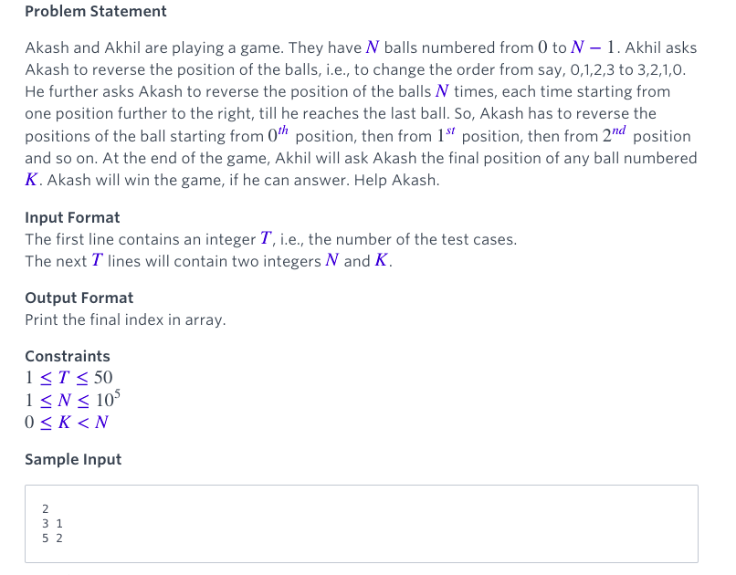
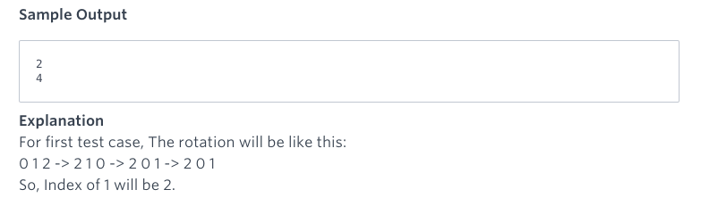

#Questions1

 - - -
#### Analysis: [codereview](http://codereview.stackexchange.com/questions/60271/reverse-game-hackerrank-ruby-solution)    

Let's analyze what the problem is saying.     
Let's say we start out with the array:

	0, 1, 2, 3, 4, 5, 6, 7, 8, 9
	
We then reverse the elements of the array starting at element 0:

	9, 8, 7, 6, 5, 4, 3, 2, 1, 0	
	
Then, we reverse all elements except the 0th element:
	
	9, 0, 1, 2, 3, 4, 5, 6, 7, 8
	
Then we reverse all elements except 0th and 1st element:    
	
	9, 0, 8, 7, 6, 5, 4, 3, 2, 1
	
And so on like so:

	9, 0, 8, 1, 2, 3, 4, 5, 6, 7
	9, 0, 8, 1, 7, 6, 5, 4, 3, 2
	9, 0, 8, 1, 7, 2, 3, 4, 5, 6
	9, 0, 8, 1, 7, 2, 6, 5, 4, 3
	9, 0, 8, 1, 7, 2, 6, 3, 4, 5

To get the final result:

	9, 0, 8, 1, 7, 2, 6, 3, 5, 4

The key thing to note here is that if take every odd-indexed element we get:
	
	9, 8, 7, 6, 5 
	
While every even-indexed element is:

	0, 1, 2, 3, 4
	
So it looks like the final sequence is constructed like this:

* Split elements into lower half and upper half
* Reverse the order of the upper half
* Merge them by taking 1 element from upper half and 1 element from lower half and so on. 

This is an O(n) process with the right implementation

All that remains is to then search the list for the given element (which is O(n) in the worst case with a standard implementation), yielding a final computational time complexity of O(n). That's it, right? Well it would be, if not for some interesting math.

- - -
If we apply some mathematical logic we can get an even faster solution:

* Decide if element is in lower half (which will have even indices) or the upper half (which will have odd indices) with a simple comparison to half the length of the array
* If element is in lower half: final index will be `1 + 2 * K` (as 0 will be in 1st index, 1 will be in 3rd, 2 will be in 5th and so on)
* If element is in upper half: final index will be `2 * (N - 1 - K)` (as N - 1 will be at 0, N - 2 will be at 2, N - 3 will be at 4 and so on)
This yields an O(1) solution! Hurray for Math!

- - - 

You can also simplify the logic a bit by noticing an interesting fact:

If you wrongly put an element from the upper half into the formula for the lower half and vice versa, an interesting thing happens: the final index will be out of the bounds of the array, and most importantly is greater than the index calculated from the other formula. The proof is left as an exercise, but this allows your entire program to boil down to:

`min(1 + 2 * K, 2 * (N - 1 - K))` for every N, K pair

